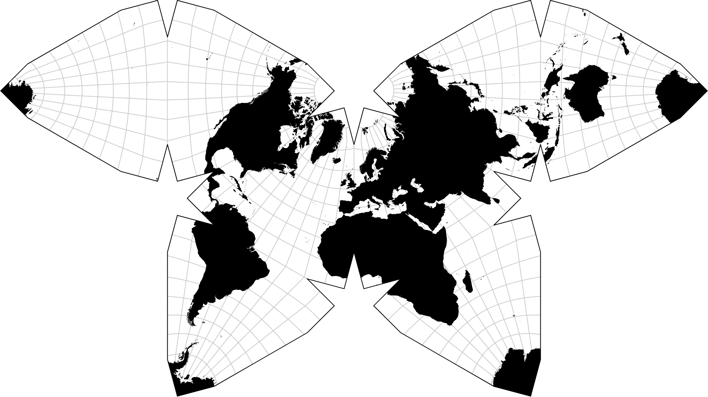
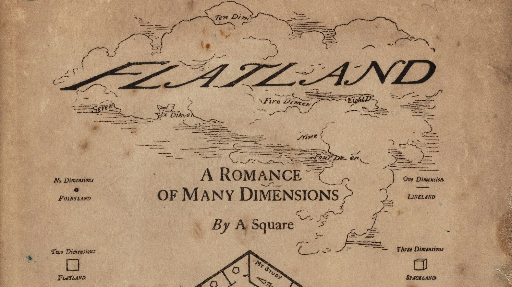
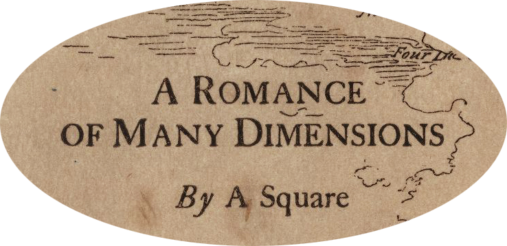
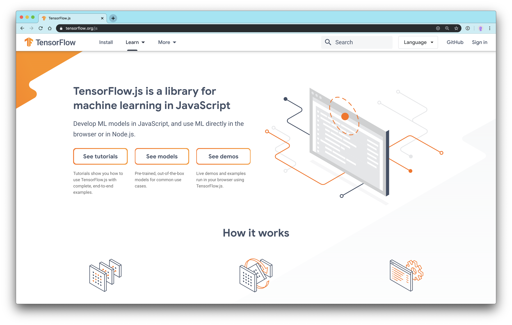
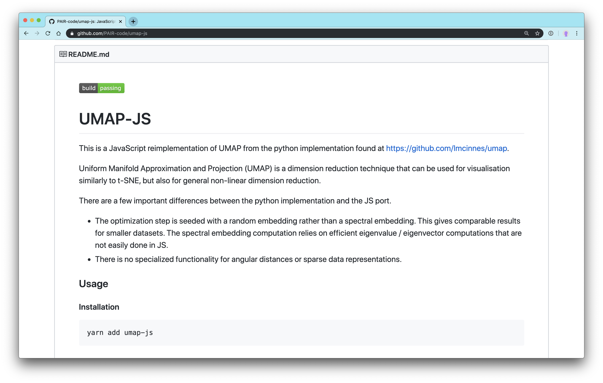
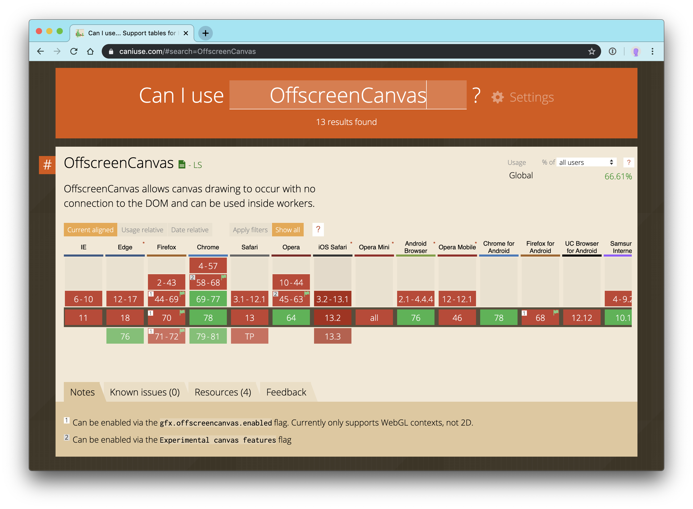

import { code } from "@mdx-deck/themes"
import { Appear, Head, Image } from "@mdx-deck/components"
import { Horizontal, Split } from "@mdx-deck/layouts"

import CodeSurfer from "code-surfer"
import oceanicNext from "prism-react-renderer/themes/oceanicNext"

import getRandomlyDistributedColors from "./utils/getRandomlyDistributedColors"
import getUniformlyDistributedColors from "./utils/getUniformlyDistributedColors"
import getRandomColorsFromAllSpaces from "./utils/getRandomColorsFromAllSpaces"

import AnimateToUMAPColorSpace from "./components/AnimateToUMAPColorSpace"
import AnimateToUMAPMNISTDigits from './components/LoadableAnimateToUMAPMNISTDigits'
import ColorSpace from "./components/LoadableColorSpace"
import Credit from "./components/Credit"
import MNISTLegend from './components/MNISTLegend'
import SingleMNISTDigit from './components/SingleMNISTDigit'
import SphereVisitsFlatland, {
  startingCameraPosition,
} from "./components/SphereVisitsFlatland"
import StitchFixLogo from "./components/StitchFixLogo"
import SVGContainer from "./components/SVGContainer"
import Three from "./components/LoadableThree"
import UMAPonMNIST from './components/LoadableUMAPonMNIST'
import UMAPonMNISTOffscreen from './components/LoadableUMAPonMNISTOffscreen'

import data1000 from './json/MNISTdigits1000.json'
import data2500 from './json/MNISTdigits2500.json'
import data5000 from './json/MNISTdigits5000.json'

import { AbsoluteTitle, List, Subtitle, Title } from "./styled"

import Browser from "./svg/Browser"
import BrowserWithMainThread from "./svg/BrowserWithMainThread"
import Flatland1 from "./svg/Flatland1"
import Flatland2 from "./svg/Flatland2"
import MainAndWorkers from "./svg/MainAndWorkers"
import UMAPAndRenderWorkers from "./svg/UMAPAndRenderWorkers"

import customTheme from "./theme"
export const themes = [code, customTheme]
const sphereVisitCamera = {
  fov: 75,
  near: 0.1,
  far: 2000,
  position: startingCameraPosition,
}

<Head>
  <link href="https://fonts.googleapis.com/css?family=Gloria+Hallelujah&display=swap" rel="stylesheet" />
  <title>escaping flatland</title>
</Head>

<Title>
  <h1>escaping flatland</h1>
  <Subtitle>
    <h2>a romance</h2>
    <h3>of</h3>
    <h2>data science</h2>
    <h2>in the browser</h2>
  </Subtitle>
</Title>

---

## Jana Beck

### data visualization engineer

<StitchFixLogo />

## @ Stitch Fix

---

<Subtitle>
  <h2>a romance</h2>
  <h3>of</h3>
  <h2>data science</h2>
  <h2>in the browser</h2>
</Subtitle>

---

<Title>
  <h1>dimensionality reduction</h1>
</Title>

---

<Credit
  asset="Waterman's Butterfly Map Projection"
  author="Mike Bostock"
  link="https://observablehq.com/@d3/watermans-butterfly?collection=@d3/d3-geo-projection"
/>

---

<Title>
  <h1>U M A P</h1>
  <h2>Uniform Manifold Approximation & Projection</h2>
</Title>

---

  | color | r | g | b |
  | --- | --- | --- | --- |
  | black | 0 | 0 | 0 |
  | white | 255 | 255 | 255 |
  | red | 255 | 0 | 0 |
  | green | 0 | 255 | 0 |
  | blue | 0 | 0 | 255 |

---

<AbsoluteTitle>UMAP on RGB</AbsoluteTitle>
<AnimateToUMAPColorSpace {...getUniformlyDistributedColors.rgb(13)} />

---

<AbsoluteTitle>UMAP on HSL</AbsoluteTitle>
<AnimateToUMAPColorSpace {...getUniformlyDistributedColors.hsl(13)} />

---

<Title>
  <h1>the MNIST digits dataset</h1>
</Title>

---

# one digit

## 10 &times; 10 pixels

## = 10 &times; 10 = 100 dimensions

---

<SingleMNISTDigit />

---

<SingleMNISTDigit overlay />

---

<SingleMNISTDigit coordinates overlay />

---

<Split>
  <SingleMNISTDigit coordinates highlight={[2,2]} overlay />
  

  |       | ... | 2,2   | 3,2 |
  | ----- | --- | ----- | --- |
  | d1 | ... | 0 | 0.825  |
  | d2 | ... | ...   | ... |

  

</Split>

---

<Split>
  <SingleMNISTDigit coordinates highlight={[3,2]} overlay />
  

  |       | ... | 2,2   | 3,2 |
  | ----- | --- | ----- | --- |
  | d1 | ... | 0   | 0.825 |
  | d2 | ... | ...   | ... |

  

</Split>

---

<MNISTLegend position='top right'/>
<AbsoluteTitle>UMAP on 5000 MNIST digits</AbsoluteTitle>
<AnimateToUMAPMNISTDigits/>

---

---

# edwin abbott abbott

---

---

<SVGContainer>
  <Flatland1 />
</SVGContainer>

---

<SVGContainer>
  <Flatland2 />
</SVGContainer>

---

<Three camera={sphereVisitCamera}>
  <SphereVisitsFlatland />
</Three>

---

<SVGContainer>
  <Browser />
</SVGContainer>

---

---

---

---

<SVGContainer>
  <BrowserWithMainThread />
</SVGContainer>

---

<SVGContainer>
  <Browser>
    <MainAndWorkers />
  </Browser>
</SVGContainer>

---

# 👷🏾‍♀️ Web Workers 👷🏻

<a
  href="https://developer.mozilla.org/en-US/docs/Web/API/Web_Workers_API/Using_web_workers"
  rel="noopener noreferrer"
  target="_blank"
>
  (MDN page)
</a>

---

<Horizontal>
  <List>
    <li>✅&nbsp;XHR</li>
    <li>✅&nbsp;self</li>
  </List>
  <List>
    <li>✖️&nbsp;DOM</li>
    <li>✖️&nbsp;window</li>
  </List>
</Horizontal>

---

# data transfer

## ✉️ ↔️ ✉️

## via message passing

---

<List fontSize="4rem">
  <li>data is copied, not shared</li>
  <li>and serialized/deserialized</li>
  <li>
    ...via&nbsp;
    <a
      href="https://developer.mozilla.org/en-US/docs/Web/API/Web_Workers_API/Structured_clone_algorithm"
      rel="noopener noreferrer"
      target="_blank"
    >
      structured cloning
    </a>
  </li>
</List>

---

# what's serializable?

---

<Split>
  <List fontSize="4rem">
    <li>✅&nbsp;primitive&nbsp;types</li>
    <li>✅&nbsp;Date</li>
    <li>✅&nbsp;Blob</li>
    <li>✅&nbsp;ArrayBuffer</li>
  </List>
  <List fontSize="4rem">
    <li>✖️&nbsp;DOM nodes</li>
    <li>✖️&nbsp;Error</li>
    <li>✖️&nbsp;functions</li>
  </List>
</Split>

---

<AbsoluteTitle>Worker template</AbsoluteTitle>
<CodeSurfer
  code={require('!raw-loader!./code/worker-template.js').default}
  theme={oceanicNext}
/>

---

<AbsoluteTitle>app-side template</AbsoluteTitle>
<CodeSurfer
  code={require('!raw-loader!./code/app-template.js').default}
  theme={oceanicNext}
/>

---

# toolchain support

- ✅&nbsp;Webpack

  - worker-loader (\*.worker.js)
  - workerize-loader

- ✅&nbsp;Parcel
- (❓) rollup

---

<Title>
  <h1>demo 1️⃣</h1>
  <h2>umap-js via a Worker</h2>
  <h2>n = 1000, iterations = true</h2>
</Title>

---

<MNISTLegend/>
<AbsoluteTitle>UMAP in Worker, n = 1000</AbsoluteTitle>
<UMAPonMNIST data={data1000} iterate />

---

<Title>
  <h1>demo 2️⃣</h1>
  <h2>umap-js via the main thread</h2>
  <h2>n = 1000, iterations = true</h2>
</Title>

---

<MNISTLegend/>
<AbsoluteTitle>UMAP in main</AbsoluteTitle>
<UMAPonMNIST data={data1000} iterate worker={false} />

---

<Title>
  <h1>demo 3️⃣</h1>
  <h2>umap-js via a Worker</h2>
  <h2>n = 2500, iterations = true</h2>
</Title>

---

<MNISTLegend/>
<AbsoluteTitle>UMAP in Worker, n = 2500</AbsoluteTitle>
<UMAPonMNIST data={data2500} iterate />

---

<Title>
  <h1>demo 4️⃣</h1>
  <h2>umap-js via a Worker</h2>
  <h2>n = 5000, iterations = true</h2>
</Title>

---

<MNISTLegend/>
<AbsoluteTitle>UMAP in Worker, n = 5000</AbsoluteTitle>
<UMAPonMNIST data={data5000} iterate />

---

# there's more! 😮

<List fontSize="4.5rem">
  <li>
    <a
      href="https://developers.google.com/web/updates/2011/12/Transferable-Objects-Lightning-Fast"
      rel="noopener noreferrer"
      target="_blank"
    >
      transferable objects
    </a>
  </li>
  <li>
    <a
      href="https://developer.mozilla.org/en-US/docs/Web/API/OffscreenCanvas"
      rel="noopener noreferrer"
      target="_blank"
    >
      OffscreenCanvas
    </a>
  </li>
</List>

---

# transferable objects

<List fontSize="4.5rem">
  <li>zero copy</li>
  <li>≈ pass by ref</li>
</List>

---

<AbsoluteTitle>transferable objects</AbsoluteTitle>
<CodeSurfer
  code={require('!raw-loader!./code/transferable-objects.js').default}
  theme={oceanicNext}
/>

---

---

<SVGContainer>
  <Browser>
    <UMAPAndRenderWorkers />
  </Browser>
</SVGContainer>

---

<AbsoluteTitle>OffscreenCanvas (app-side)</AbsoluteTitle>
<CodeSurfer
  code={require('!raw-loader!./code/transfer-offscreen-canvas.js').default}
  theme={oceanicNext}
/>

---

<AbsoluteTitle>OffscreenCanvas (Worker-side)</AbsoluteTitle>
<CodeSurfer
  code={require('!raw-loader!./code/render-worker.js').default}
  theme={oceanicNext}
/>

---

<Title>
  <h1>demo 5️⃣</h1>
  <h2>umap-js via 2 Workers & OffscreenCanvas</h2>
  <h3>compute Worker, render Worker</h3>
  <h2>n = 5000, iterations = true</h2>
</Title>

---

<MNISTLegend/>

<AbsoluteTitle>UMAP & render in Workers, n = 5000</AbsoluteTitle>
<UMAPonMNISTOffscreen data={data5000} iterate />

---

<Title>
  <h2>Web Workers + OffscreenCanvas</h2>
  <h2>(via transferable objects)</h2>
  <h1>= escaping flatland</h1>
</Title>

---

### Twitter: @iPancreas

### GitHub: @jebeck

## slides: janabeck.com/flatland/

---

## talk stack!

- mdx-deck@2.x + CodeSurfer@0.x
- 3D WebGL: three.js via react-three-fiber
- 2D WebGL: PixiJS
- animations: react-spring and TweenJS
- ...and a bit of
   + inline SVG
   + regular Canvas